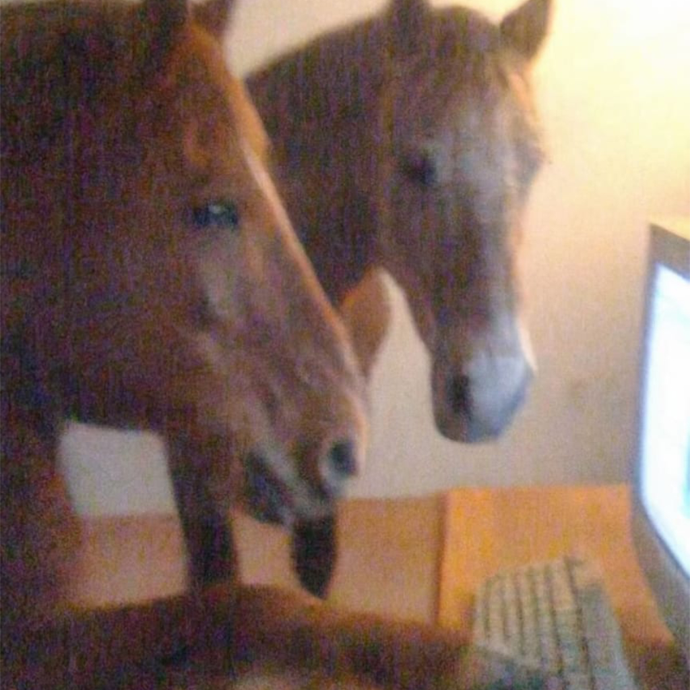

<p align="center">
  
  <br />
  <h1 align="center">LUCE</h1>
  <p align="center">Keyboard Cleaning Mode for Mac</p>
  <p align="center">
    <a href="https://github.com/arinltte/LUCE/releases/latest"></a>
    <a href="https://github.com/arinltte/LUCE/blob/main/LICENSE"></a>
    
    
  </p>
</p>

---

LUCE is a lightweight macOS menu bar utility that lets you safely clean your keyboard without triggering accidental key presses or system shortcuts. One click locks the keyboard entirely — and one click brings it back.

---

> “In Italian, *LUCE* translates to ‘light’ or ‘illumination.’ Ferrari chose this name to symbolize a ‘new dawn’ for the company and their forward-looking multi-energy strategy, rather than purely referencing the car’s weight.”
> — Ferrari, 2026

## Features

- **Keyboard Cleaning Mode** — Locks all keyboard input at the system level using a CGEvent tap, blocking key-down, key-up, modifier flags, and media keys (brightness, volume, play/pause).
- **Brightness Safety Check** — Before locking, LUCE reads the current display brightness. If it is below 20%, a persistent warning is shown prompting you to raise it first — so you can always see the Unlock button while cleaning.
- **Floating Panel** — A compact, always-on-top panel that anchors to the top edge of your screen and stays accessible during keyboard lock. Dismisses with Escape when unlocked.
- **Crash-Safe Unlock** — An `atexit` handler and `deinit` path both call `emergencyUnlock`, ensuring the keyboard is always restored even on unexpected termination.
- **Theme Customisation** — Choose from four ambient background themes: Default, Rare Jade, Deep Ocean, and Floral.
- **Menu Bar Icon Selection** — Pick from a set of SF Symbols to match your setup.
- **Automatic Update Check** — The About panel checks GitHub Releases for newer versions and links directly to the download page when one is found.
- **Minimal footprint** — Pure Swift/SwiftUI, no third-party dependencies, no background services.

---

## Requirements

- macOS 14 (Sonoma) or later
- Xcode 15 or later (to build from source)
- **Accessibility permission** — required for the CGEvent tap that blocks keyboard input. LUCE will prompt for this automatically.

---

## Installation

### Recommended

Download the latest `.dmg` from the [Releases](https://github.com/arinltte/LUCE/releases/latest) page, open it, and drag **LUCE** to your Applications folder.

### Gatekeeper

If macOS blocks the app on first launch, run the following in Terminal after installation:

```bash
xattr -rd com.apple.quarantine /Applications/LUCE.app
```

Then open **System Settings → Privacy & Security → Accessibility** and enable LUCE.

---

## Usage

1. Click the LUCE icon in your menu bar.
2. Click **Lock Keyboard** — the panel switches to Locked state and all keyboard input is blocked.
3. Clean your keyboard.
4. Click **Unlock** (mouse or trackpad only) to restore normal input.

The panel can be dismissed at any time by pressing Escape (when unlocked) or by clicking the menu bar icon again.

---

## Brightness Warning

LUCE checks your screen brightness when you attempt to lock. If it is below 20%, locking is blocked and a warning is displayed:

> Screen brightness is at X%. Increase to at least 20% before locking so you can see the Unlock button.

Raise brightness using your trackpad or the Control Centre, then click Lock Keyboard again.

---

## Themes

The About panel exposes four ambient themes that apply a subtle animated radial glow to the panel background:

| Theme | Accent |
|---|---|
| Default | System blue |
| Rare Jade | Teal green |
| Deep Ocean | Electric blue |
| Floral | Magenta pink |

Theme preference is saved to `UserDefaults` and restored on next launch.

---

## Tech Stack

- **Swift 5.9+**
- **SwiftUI** — UI layer
- **AppKit / NSPanel** — Floating panel, status bar item
- **CoreGraphics** — CGEvent tap for keyboard blocking
- **IOKit / DisplayServices** — Brightness reading (Apple Silicon + Intel)
- **ApplicationServices** — Accessibility permission checks

No third-party packages or Swift Package Manager dependencies.

---

## Project Structure

```
LUCE/
├── Assets.xcassets/       # App icon and asset catalog
├── FloatingPanel.swift    # NSPanel subclass — floating, borderless, top-edge-anchored
├── LUCEApp.swift          # App entry point, AppDelegate, status bar setup
├── LUCEClient.swift       # Core logic — keyboard lock, brightness, permissions
├── LUCETheme.swift        # Theme definitions and ambient background view
└── LUCEView.swift         # SwiftUI views — main, locked, about panels
```

---

## Building from Source

```bash
git clone https://github.com/arinltte/LUCE.git
cd LUCE
open LUCE.xcodeproj
```

Build and run the `LUCE` scheme in Xcode. No dependency resolution required — there are no external packages.

---

## Privacy

LUCE does not collect, transmit, or log any data.

| Location | Contents |
|---|---|
| `~/Library/Preferences/com.arinltte.LUCE.plist` | Theme and menu bar icon preference |

To uninstall completely:

```bash
rm -rf /Applications/LUCE.app
rm -f ~/Library/Preferences/com.arinltte.LUCE.plist
rm -rf ~/Library/Application\ Support/com.arinltte.LUCE 2>/dev/null
rm -rf ~/Library/Saved\ Application\ State/com.arinltte.LUCE.savedState 2>/dev/null
```

---

## License

Distributed under the MIT License. See `LICENSE` for details.

<p align="center">
  <i>Developed by arinltte · cjshen00@gmail.com</i>
</p>
